# MikroTik Extended — Home Assistant Integration


[](https://github.com/hacs/integration)
[](https://github.com/Csontikka/ha-mikrotik-extended/blob/master/LICENSE)
[](https://sonarcloud.io/summary/new_code?id=Csontikka_ha-mikrotik-extended)
[](https://sonarcloud.io/summary/new_code?id=Csontikka_ha-mikrotik-extended)
[](https://sonarcloud.io/summary/new_code?id=Csontikka_ha-mikrotik-extended)
[](https://github.com/sponsors/Csontikka)
[](https://buymeacoffee.com/Csontikka)

> **Note:** For best viewing experience, read this documentation on [GitHub](https://github.com/Csontikka/ha-mikrotik-extended).

Full-featured Home Assistant integration for MikroTik routers running **RouterOS 7+**. Monitor system resources, control firewall rules, track network devices, manage WireGuard peers, containers, and more — all from your HA dashboard. Supports multiple routers simultaneously.

## Comparison with the core integration

Home Assistant ships its own `mikrotik` integration, and it grew a lot in 2026: the
**2026.9** release added PoE control, interface switches and link status, and **2026.10**
adds a reconfigure flow and the removal of interfaces that disappeared. The table below is
a snapshot taken on **3 October 2026**, checked against the source of both projects, with
the core integration as in the **2026.10.0b0** beta. It will be checked again when 2026.10
is released.

The two can be installed side by side. This one is a standalone integration with its own
domain, `mikrotik_extended`, so nothing conflicts.

| Feature | Core<br>2026.10.0b0 | MikroTik<br>Extended |
| --- | :---: | :---: |
| **System** | | |
| CPU load, memory and disk usage, uptime | ✅ | ✅ |
| Temperature and voltage | ✅ | ✅ |
| Separate CPU, board, PHY and switch temperatures | CPU and board | ✅ |
| PSU current and voltage (PSU1, PSU2) | ✅ | ✅ |
| Fan speeds (fan1 to fan4) | ❌ | ✅ |
| UPS status | ❌ | ✅ |
| GPS coordinates | ❌ | ✅ |
| Reboot | ✅ | ✅ |
| Shut down | button | action |
| Configuration backup | ✅ | ✅ |
| **Interfaces** | | |
| Link status | ✅ | ✅ |
| Enable and disable | ether, wlan | ✅ |
| TX and RX traffic rates and totals | ❌ | ✅ |
| IP address per interface | ❌ | ✅ |
| SFP status and information | ❌ | ✅ |
| Interfaces that disappear from the router are removed as devices | ✅ | ✅ |
| PoE output mode control | ✅ | ✅ |
| PoE consumption | ✅ | ✅ |
| Live PoE output status per port | ❌ | ✅ |
| **Firewall and routing** | | |
| NAT, mangle, filter and routing rules as switches | ❌ | ✅ |
| Simple queues | ❌ | ✅ |
| **Network** | | |
| Device tracking by ARP | ✅ | ✅ |
| Force DHCP leases instead of ARP | ✅ | ❌ |
| Wired and wireless client counts | ❌ | ✅ |
| Wireless clients (CAPsMAN and WiFi) | ❌ | ✅ |
| WireGuard peers | ❌ | ✅ |
| Containers | ❌ | ✅ |
| NetWatch | ❌ | ✅ |
| PPP users | ❌ | ✅ |
| Captive portal clients | ❌ | ✅ |
| Kid Control | ❌ | ✅ |
| Per-client traffic | ❌ | ✅ |
| IP Cloud | ❌ | ✅ |
| Scripts | ❌ | ✅ |
| **Firmware** | | |
| RouterOS update | ✅ | ✅ |
| RouterBoard firmware update | ✅ | ✅ |
| **Actions** | | |
| Wake-on-LAN | ❌ | ✅ |
| RouterOS environment variables | ❌ | ✅ |
| Raw API test | ❌ | ✅ |
| Manual data refresh | ❌ | ✅ |
| **Setup** | | |
| Config flow, multiple routers, SSL, ARP ping | ✅ | ✅ |
| Reconfigure the connection without removing the entry | ✅ | ✅ |
| Entity categories individually switchable | ❌ | ✅ |
| Automatic discovery over MNDP | ❌ | ✅ |

The core integration is under active development, so this table will age. If you spot a
row that is out of date, open an issue and it will be corrected.

Built for **RouterOS 7+**, with a full test suite. The official integration quality scale
covers core integrations only, where `mikrotik` is rated **Gold** in 2026.10; this project
tracks the same rules in its own `quality_scale.yaml`, which is a self-assessment and stands
at **Gold**.

## Features

### System Monitoring

CPU load, memory/HDD usage, uptime, temperatures (CPU, board, PHY, switch), voltage, power consumption, PSU metrics (current/voltage for PSU1/PSU2), fan speeds (fan1-fan4), UPS status, GPS coordinates. Each router also gets a reboot button entity.

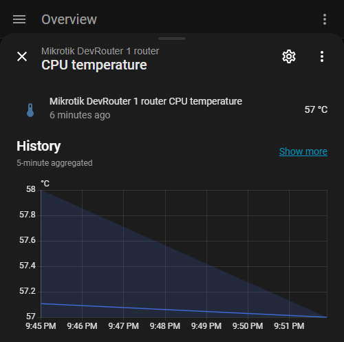

### Network Interfaces

Per-interface monitoring: link status (binary sensor), enable/disable (switch), TX/RX traffic rates and totals (optional), IP address sensor per interface, SFP status and information, PoE output mode control per port with live power status (the selector is part of the interface entities, so it follows that option), PoE out power, voltage and current sensors on every port that measures them, connected device MAC/IP info per interface.

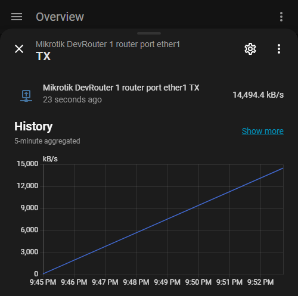

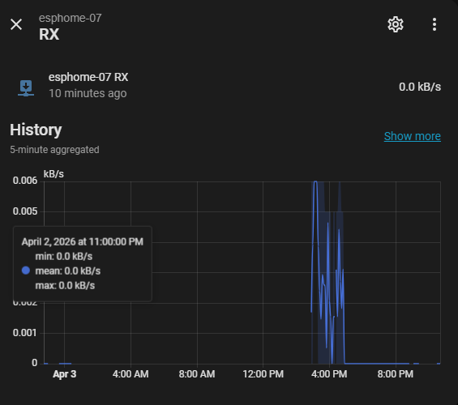

### Firewall & Routing Rules

Monitor and control individual rules — each gets a switch entity:

- NAT rules
- Mangle rules
- Filter rules
- Raw rules
- Routing rules

More information: [MikroTik Firewall documentation](https://help.mikrotik.com/docs/display/ROS/Firewall)

### LTE / 5G modem

For a router with an LTE or 5G modem, per modem:

- Sensors for the operator, the access technology, the signal levels (RSSI, RSRP, RSRQ, SINR, CQI), the primary band and the carrier aggregation bands, and a connection binary sensor.
- For a modem set up for 5G, 5G RSRP, RSRQ and SINR sensors as well. They read unknown while the modem is on LTE, which a 5G NSA modem is whenever it carries no traffic.
- Cell id, eNB id, sector id, physical cell id, session uptime, LTE and 5G modulation, modem model and firmware revision as attributes of the operator sensor.

IMEI, IMSI and ICCID are not kept: they are dropped from the modem's reply before anything is stored, so they appear in no entity, attribute or diagnostics dump. Enable **LTE / 5G modem sensors** in the options; it costs one query for the modem list and one per modem on every poll, and a router without a modem is never asked.

### Routes

A binary sensor for every static IPv4 route and for every IPv4 default route, on while the route is active:

- A failover pair with `check-gateway` shows which of the two routes is carrying traffic.
- A default route handed out by PPPoE or DHCP leaves the routing table when the link drops. Its sensor stays and turns off, also when Home Assistant restarts during the outage, so an automation can react to the WAN going down.
- Attributes: destination, gateway, immediate gateway, distance, routing table, comment, and whether the route is enabled, dynamic and still present in the table.
- An **Active WAN** sensor per router names the interface the active default route of the `main` table leaves through, `pppoe-out1` or `lte1` for example, with the gateway and distance as attributes. It reads `none` when no default route is active, or when the active one is a blackhole route, `unknown` until the routing table has been read, and lists every interface when several are active at once. With a main and a failover connection it tells which of the two is carrying the traffic.

Other dynamic routes (connected, OSPF, BGP) are not read, so a large routing table costs nothing. Enable **Route sensors** in the options.

A route is identified by its destination, gateway and routing table, so changing any of those on the router gives a new sensor. The sensor of a removed static route goes away on the next reload. A dynamic default route that was replaced by another one on the same interface, a DHCP lease with a new gateway for example, loses its sensor as well; one that was removed for good, with nothing in its place, keeps its sensor in the off state until you turn **Route sensors** off and on again.

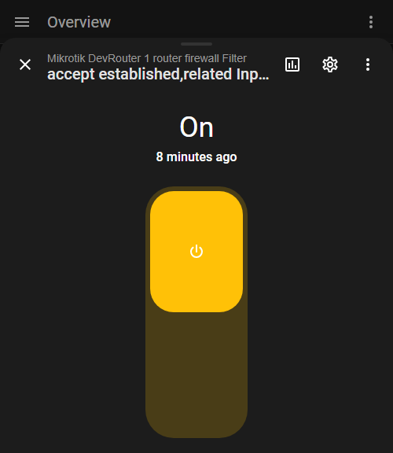

Detailed rule information available per entity (chain, action, protocol, addresses, ports, connection state):

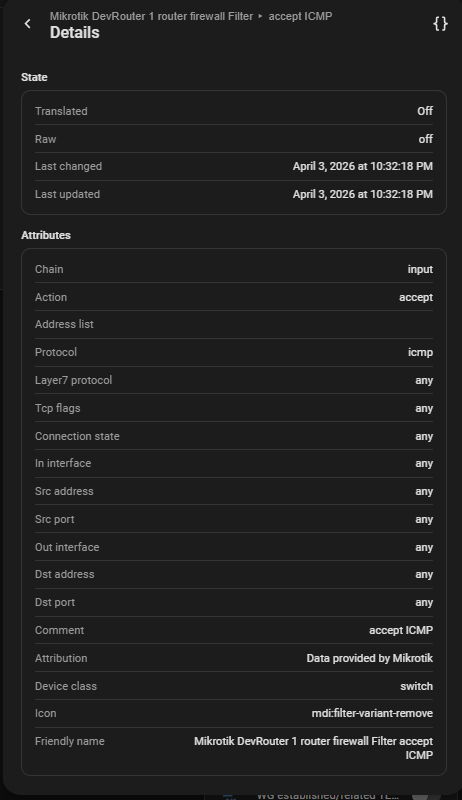

> **Give your rules a comment.** When a rule has a comment, the integration identifies its entity by that comment, so editing the rule on the router (changing a port, an address or an interface) keeps the same entity and your automations keep working. Rules without a comment are identified by their contents instead, which means editing such a rule replaces its entity. The same applies to simple queues.

### Device Tracking

ARP-based network host presence tracking. Configurable timeout (default 180s). Shows MAC address, IP, and connected interface as attributes.

**What the client counts mean:** *Wireless clients* are hosts seen in the router's WiFi/CAPsMAN registration table. *Wired clients* are all other active ARP hosts — i.e. everything in the ARP table **minus** the WiFi-registered MACs. The count is by unique MAC across **all routed subnets/VLANs** the router sees (not per physical port), so it can be higher than the number of devices on a single LAN. A wireless device connected through a separate AP/mesh (not registered on this router) appears only in ARP and is therefore counted as wired. Container `veth` endpoints are excluded, and they get no device tracker either, since a container endpoint is not a device on your network.

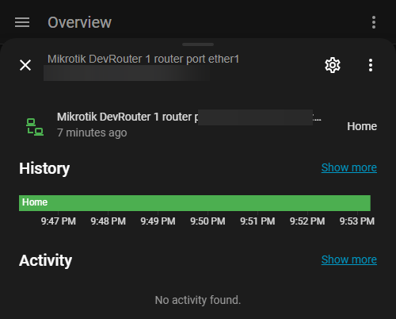

### WireGuard (RouterOS 7+)

Each WireGuard peer gets its own device with:

- **Switch**: enable/disable peer
- **Binary sensor**: connected status (based on last handshake < 3 minutes)
- **Sensors**: RX bytes, TX bytes, last handshake

Peer display name: `name` field, then `comment`, then first 8 chars of public key.

Enable via integration options -> WireGuard peer sensors.

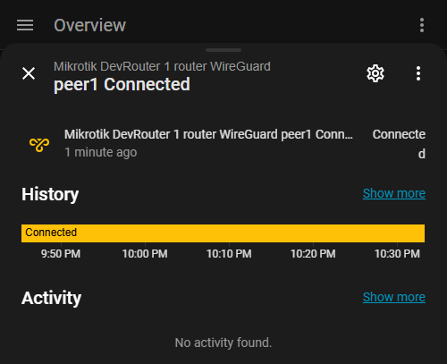

### Containers (RouterOS 7+)

Each container gets its own device with:

- **Switch**: start/stop container
- **Sensor**: status (running/stopped/pulling/building/error)
- **Attributes**: tag, OS, arch, interface, memory/CPU usage

Enable via integration options -> Container sensors.

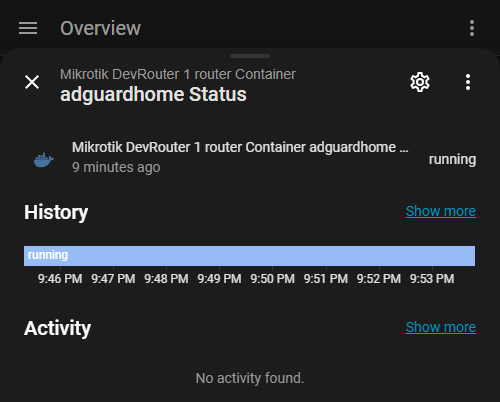

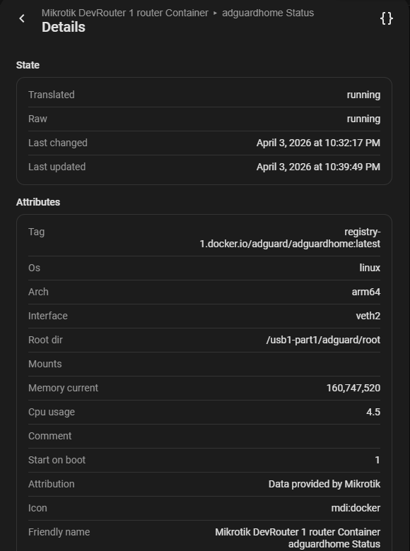

### Client Traffic

Per-device bandwidth monitoring. 2 sensors per tracked device (total TX/RX).

Uses Kid Control backend. The integration auto-creates an `ha-monitoring` profile (unrestricted) on the router when enabled. If the API user lacks write permission, a warning is logged with the manual command:

```
/ip/kid-control/add name=ha-monitoring mon=0s-1d tue=0s-1d wed=0s-1d thu=0s-1d fri=0s-1d sat=0s-1d sun=0s-1d
```

Without the required backend, sensors show "unavailable" instead of 0.

<!-- Client traffic screenshot placeholder — enable sensor_client_traffic to capture -->

### Additional Features

- **Kid Control** — enable/disable/pause rules per child profile
- **PPP Users** — monitor and control PPP secrets and active connections (v7+)
- **Simple Queues** — enable/disable queue rules (note: FastTracked packets bypass queues)
- **Captive Portal** — track hotspot/guest portal authorized clients
- **Scripts** — execute RouterOS scripts via button entities
- **Netwatch** — monitor host reachability (binary sensor per watched host, with probe statistics such as RTT and packet loss as attributes)
- **Environment Variables** — read RouterOS script environment variable values
- **DHCP Leases** — sensor showing total DHCP lease count, with bound count and per-lease details (MAC, IP, hostname, status, server, interface) as attributes
- **IP Cloud** — public IP address sensor via MikroTik cloud service
- **Device Mode & Packages** — diagnostic sensors showing enabled features and installed packages
- **Wireless clients** from every wifi stack the router runs: the legacy `wireless` package with its CAPsMAN controller, `wifiwave2`, and the `wifi` stack of RouterOS 7.13 and later, also side by side (auto-detected)

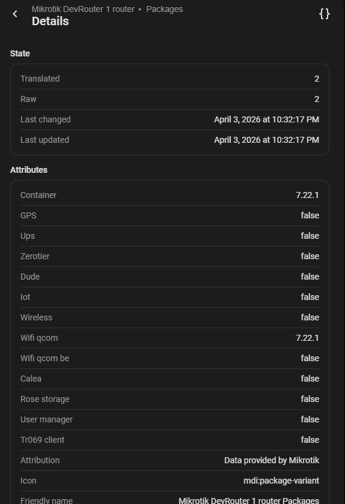

### Netwatch sensor names

A sensor is named after the probe's own `name` when it has one (RouterOS 7), otherwise after its comment, otherwise after the watched host. Naming a probe on the router later only changes what the sensor is called; the entity and its `entity_id` stay.

### Netwatch probe statistics

For `icmp` type netwatch entries the binary sensor exposes the probe measurements as attributes: `rtt_avg`, `rtt_min`, `rtt_max`, `rtt_jitter`, `rtt_stdev` (all in milliseconds), `loss_percent`, `sent_count`, `response_count` and `since`. Other probe types report only the fields the router provides for them. The values can be used directly in automations:

```yaml
automation:
  - alias: "Warn on high WAN latency"
    trigger:
      - platform: numeric_state
        entity_id: binary_sensor.mikrotik_myrouter_netwatch_wan_probe
        attribute: rtt_avg
        above: 100
    action:
      - service: notify.mobile_app
        data:
          message: "WAN latency is above 100 ms"
```

The statistic attributes are intentionally excluded from the recorder, so they do not grow the Home Assistant database. If you want to chart one of them, create a template sensor for it:

```yaml
template:
  - sensor:
      - name: "WAN probe RTT"
        unit_of_measurement: "ms"
        state: "{{ state_attr('binary_sensor.mikrotik_myrouter_netwatch_wan_probe', 'rtt_avg') }}"
```

### Firmware Updates

Update RouterOS and RouterBoard firmware directly from Home Assistant.

- **RouterOS update** — with changelog and optional automatic backup before install
- **RouterBoard firmware update** — upgrades board firmware and reboots

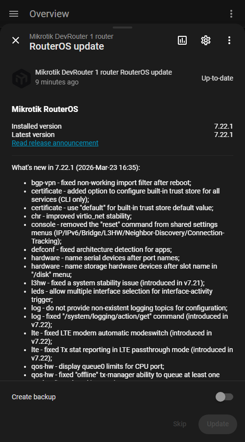

### Configuration Backup

The **Configuration backup** button writes a backup on the router itself, under a fixed name so that pressing it again replaces the previous one instead of filling the storage with dated copies. Handy right before changing something on the router.

The file stays on the device: RouterOS does not expose file contents over its API, so there is nothing for Home Assistant to fetch. Retrieve it the usual way, through the router's Files list, FTP or SFTP.

### Actions (Services)

- **Wake-on-LAN** (`mikrotik_extended.send_magic_packet`): send a WoL magic packet through the router to wake up a network device.

  **Parameters:** `mac` (required), `interface` (required — the router interface to send the packet from, e.g. `bridge`).

  ```yaml
  action: mikrotik_extended.send_magic_packet
  data:
    mac: "AA:BB:CC:DD:EE:FF"
    interface: "bridge"
  ```

  **Example — automation:**

  ```yaml
  automation:
    - alias: "Wake up server when I get home"
      trigger:
        - platform: zone
          entity_id: person.me
          zone: zone.home
          event: enter
      action:
        - action: mikrotik_extended.send_magic_packet
          data:
            mac: "AA:BB:CC:DD:EE:FF"
            interface: "bridge"
  ```

- **API Test** (`mikrotik_extended.api_test`): diagnostic action for raw RouterOS API queries or coordinator data inspection. Use in **Developer Tools -> Actions** with "Return response" enabled.

  **Parameters:** `path` (required), `limit` (optional, default 10), `host` (optional), `coordinator_data`* (optional).

  ```yaml
  # Query router interfaces
  action: mikrotik_extended.api_test
  data:
    path: "/interface"
    limit: 20
  ```

  ```yaml
  # Inspect coordinator's processed data
  action: mikrotik_extended.api_test
  data:
    path: "interface"
    coordinator_data: true
  ```

  > **\*coordinator_data:** When set to `true`, the `path` parameter is treated as a coordinator data key (e.g. `interface`, `dhcp`, `arp`) instead of a RouterOS API path. This returns the integration's internally cached and processed data from the last update cycle — useful for debugging what the integration currently "sees" without making an additional API call to the router.

- **Refresh Data** (`mikrotik_extended.refresh_data`): force an immediate data refresh from the router, including all sensors, environment variables, and device trackers. Useful in automations when you need up-to-date values without waiting for the next poll cycle.

  **Parameters:** `host` (optional — only refresh a specific router).

  ```yaml
  action: mikrotik_extended.refresh_data
  ```

  **Example — refresh after changing a firewall rule:**

  ```yaml
  automation:
    - alias: "Refresh after guest network toggle"
      trigger:
        - platform: state
          entity_id: input_boolean.guest_network
      action:
        - action: mikrotik_extended.set_environment
          data:
            name: "guestEnabled"
            value: "{{ states('input_boolean.guest_network') }}"
        - delay: 3
        - action: mikrotik_extended.refresh_data
  ```

- **Set Environment Variable** (`mikrotik_extended.set_environment`): create, update, or remove a RouterOS script environment variable. Environment variables are accessible from RouterOS scripts via `:global` and can be used to pass values between Home Assistant and router-side scripts.

  **Parameters:** `name` (required), `value` (required for set/add), `action` (optional: `set`, `add`, or `remove` — default `set`), `host` (optional).

  ```yaml
  # Create or update a variable
  action: mikrotik_extended.set_environment
  data:
    name: "myVar"
    value: "hello"
    action: "set"
  ```

  ```yaml
  # Remove a variable
  action: mikrotik_extended.set_environment
  data:
    name: "myVar"
    action: "remove"
  ```

  > **Note:** Creating a new variable takes ~2 seconds (uses a one-shot RouterOS scheduler internally). Updating an existing variable is instant. The variable is accessible from RouterOS scripts via `:global myVar; :put $myVar`.

- **Shut down router** (`mikrotik_extended.shutdown`): powers off the router. It cannot be started again over the network, so it stays off until power is cycled or someone starts it on site. Intended for automations, for example a clean shutdown while a UPS still has charge, or when a temperature reading is dangerously high. Deliberately an action rather than a button, so a stray click on a dashboard cannot trigger it.

  **Parameters:** `host` (required, because naming the router is the safety catch: one call cannot power off every configured router at once).

  ```yaml
  action: mikrotik_extended.shutdown
  data:
    host: "192.168.88.1"
  ```

  **Example, a clean shutdown while the UPS still has charge:**

  ```yaml
  automation:
    - alias: "Shut the router down on low UPS battery"
      triggers:
        - trigger: numeric_state
          entity_id: sensor.ups_battery
          below: 15
      actions:
        - action: mikrotik_extended.shutdown
          data:
            host: "192.168.88.1"
  ```

## Use cases

What people set this integration up for, and which part of it does the job:

- **Presence from the router.** Every host the router sees in its ARP, DHCP and wireless registration tables becomes a device tracker, so the phones on your WiFi drive home/away automations without an app on the phone. The *Host tracking timeout* and *Device tracker interval* options tune how quickly a device is marked away.
- **Know when the internet fails over.** With route sensors on, the *Active WAN* sensor names the interface the default route leaves through, and the per-route binary sensors show which default routes are up. A change on that sensor is the trigger for a notification, or for pausing backups while on the LTE line.
- **Watch a link that matters.** Netwatch probes on the router become binary sensors with round trip time and loss as attributes; a probe going down can restart a PoE-fed access point through the PoE selector, or switch a WireGuard peer on.
- **Switch things on the router from Home Assistant.** Firewall rules (filter, NAT, mangle, raw), Kid Control, WireGuard peers, interfaces, containers, PoE output, scripts and the configuration backup are entities or actions, so a schedule or a dashboard button can toggle them. A change the router does not make fails the call, so an automation sees it.
- **Capacity and health.** Traffic per interface and per client, CPU, memory, temperature, port error counters, firmware update availability, and the LTE / 5G modem signal on routers with a modem.

The [Automation Examples](#automation-examples) below show two of these in full.

## Automation Examples

### Auto-enable WireGuard VPN when leaving home

Automatically enable your WireGuard VPN peer when you leave the house, and disable it when you return.

```yaml
automation:
  - alias: "Enable VPN when leaving home"
    trigger:
      - platform: zone
        entity_id: person.me
        zone: zone.home
        event: leave
    action:
      - action: switch.turn_on
        target:
          entity_id: switch.mikrotik_extended_wireguard_peer_my_phone

  - alias: "Disable VPN when arriving home"
    trigger:
      - platform: zone
        entity_id: person.me
        zone: zone.home
        event: enter
    action:
      - action: switch.turn_off
        target:
          entity_id: switch.mikrotik_extended_wireguard_peer_my_phone
```

### Kids internet schedule with Kid Control

Automatically pause internet access for children on school nights.

```yaml
automation:
  - alias: "Kids internet off on school nights"
    trigger:
      - platform: time
        at: "21:00:00"
    condition:
      - condition: time
        weekday: [mon, tue, wed, thu, sun]
    action:
      - action: switch.turn_off
        target:
          entity_id: switch.mikrotik_extended_kidcontrol_kids_paused

  - alias: "Kids internet on in the morning"
    trigger:
      - platform: time
        at: "07:00:00"
    condition:
      - condition: time
        weekday: [mon, tue, wed, thu, fri]
    action:
      - action: switch.turn_on
        target:
          entity_id: switch.mikrotik_extended_kidcontrol_kids_paused
```

## Feature Availability

| Feature | RouterOS 7+ | RouterOS 6* | Optional |
|---------|:---:|:---:|:---:|
| System monitoring (CPU, memory, temps, fans, PSU, uptime) | ✓ | ✓ | No |
| Network interfaces (status, traffic, IP address) | ✓ | ✓ | Traffic: Yes |
| PoE out control (per port) | ✓ | ? | With interfaces |
| PoE out power, voltage, current (per port, where the hardware measures) | ✓ | ? | With interfaces |
| Firewall rules (NAT, mangle, filter, raw) | ✓ | ✓ | Yes |
| Routing rules | ✓ | ✓ | Yes |
| Route sensors (static and default routes) | ✓ | ? | Yes |
| LTE / 5G modem sensors | ✓ | ? | Yes |
| Device tracking (ARP) | ✓ | ✓ | Yes |
| WireGuard peers | ✓ | — | Yes |
| Containers | ✓ | — | Yes |
| Client traffic (Kid Control) | ✓ | — | Yes |
| Kid Control | ✓ | ✓ | Yes |
| PPP users | ✓ | — | Yes |
| Simple queues | ✓ | ✓ | Yes |
| Captive portal | ✓ | ✓ | Yes |
| Scripts | ✓ | ✓ | Yes |
| Netwatch | ✓ | ✓ | Yes |
| Environment variables | ✓ | ✓ | Yes |
| DHCP leases | ✓ | ? | No |
| WiFi (wifiwave2/wifi-qcom) | ✓ | — | Auto |
| CAPsMAN (wireless controller) | — | ✓ | Auto |
| UPS monitoring | ✓ | ✓ | Package |
| GPS coordinates | ✓ | ✓ | Package |
| IP Cloud (public IP) | ✓ | ✓ | No |
| Device mode & packages | ✓ | — | No |
| Firmware updates | ✓ | ✓ | No |
| Wake-on-LAN service | ✓ | ? | No |
| API Test service | ✓ | ? | No |
| Refresh Data service | ✓ | ? | No |
| Set Environment service | ✓ | ? | No |
| Reboot button | ✓ | ✓ | No |
| Configuration backup button | ✓ | ? | No |
| Shutdown service | ✓ | ? | No |
| Multi-router support | ✓ | ✓ | No |

> **?** = not tested on RouterOS 6.
>
> **\*RouterOS 6 is not officially supported.** Basic features may still work, but v6 is not tested or maintained. Upgrade to RouterOS 7 is strongly recommended.
>
> Active development and testing is done on a **MikroTik hAP ax³** running the latest stable RouterOS 7 and a **Cloud Hosted Router (CHR)** virtual instance.

## Installation

This integration is available in the [HACS](https://hacs.xyz/) default store.

1. Open **HACS** in Home Assistant
2. Search for **MikroTik Extended** and install it
3. Restart Home Assistant

> If you previously added this repository as a HACS custom repository, no action is needed: updates continue to work, and the custom repository entry can stay as it is.

### Requirements

- Home Assistant 2024.11.0 or later
- RouterOS 7+ (v6 is not officially supported — see [Feature Availability](#feature-availability))
- API user with permissions: `read, write, api, reboot, policy, test, sensitive`
  > All permissions are recommended. Without `write`, switches and Kid Control auto-setup won't work. Without `reboot`, the reboot button is unavailable.

## Configuration

### Initial Setup

1. Create a user on your MikroTik router with the required permissions (see above)
2. In Home Assistant: **Settings -> Devices & Services -> Add Integration -> MikroTik Extended**
3. Choose whether to **scan the network** for MikroTik routers automatically:
   - **Scan** — the integration scans the local /24 subnet, checks the ARP table for MikroTik devices (by MAC OUI), and listens for MNDP broadcast announcements. Found routers are listed sorted by IP address — select one or choose *Enter manually*. If nothing is found, the manual entry form opens with an info message.
   - **Skip** — go directly to manual entry
   > **Tip:** Router names appear in the list if SNMP or MNDP is enabled on the router. For SNMP, enable it with community string `public` (`/snmp set enabled=yes`). For MNDP, ensure neighbor discovery is active on the interface facing HA (`/ip neighbor discovery-settings set discover-interface-list=all`).

   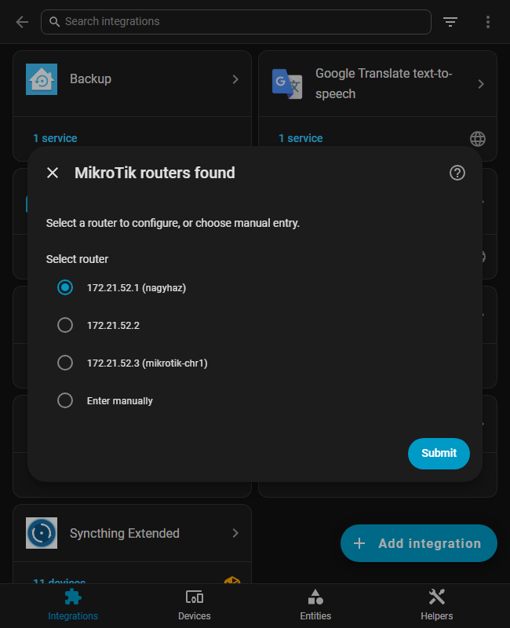

4. Fill in the connection details (see parameters below)

   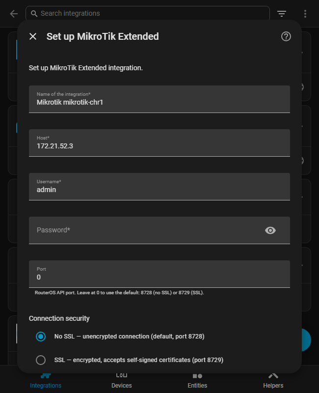

5. Choose a sensor preset and finish setup

   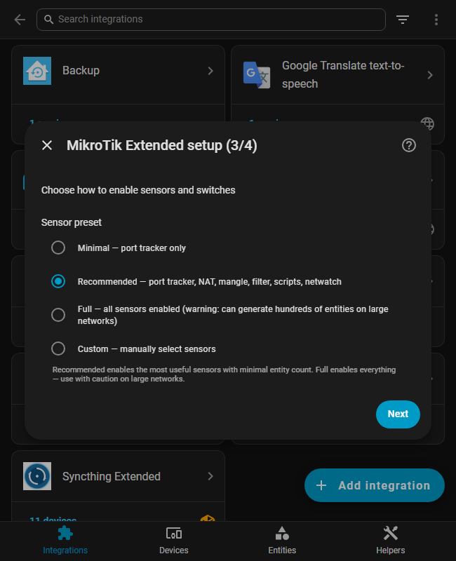

### Installation Parameters

These fields are shown during the initial setup wizard:

| Parameter | Required | Default | Description |
|-----------|----------|---------|-------------|
| Name | Yes | `Mikrotik` | Display name for this integration instance |
| Host | Yes | `192.168.88.1` | IP address or hostname of the MikroTik router |
| Username | Yes | `admin` | RouterOS API username |
| Password | Yes | — | RouterOS API password |
| Port | No | `0` | API port (`0` = auto-detect: 8728 plain, 8729 SSL) |
| SSL Mode | No | `none` | `none` — plain (port 8728); `ssl` — encrypted, self-signed OK (port 8729); `ssl_verify` — encrypted, CA-signed cert required |

### Configuration Parameters

These options can be changed after setup via **Settings -> Devices & Services -> MikroTik Extended -> Configure**. Changes take effect immediately — no HA restart needed.

| Parameter | Default | Description |
|-----------|---------|-------------|
| Scan interval | `30` s | How often the router is polled (minimum 10 s). Lower values increase load on the router. |
| Device tracker interval | `10` s | How often tracked devices are pinged and their trackers refreshed (5 to 300 s, and never more than half the host tracking timeout unless that would be under 5 s). Raise it on large networks to lower the load on the router. Home/away changes can lag by up to one interval. |
| Host tracking timeout | `180` s | Seconds after the last ARP/DHCP/wireless activity before a network device is marked as away. |
| Zone | `home` | HA zone used for device tracker `home`/`not_home` state. |
| Sensor preset | recommended | Quick preset selector — see below. |
| Interface entities | enabled | Per-interface entities: port switches, port trackers, traffic sensors and IP address sensors. Disable to monitor only the core device, useful on large switches. Disabling also skips the per-port link queries, which is where most of the polling load on a large switch comes from. Note that disabling removes those entities and their per-port devices from Home Assistant, so a renamed port or an assigned area is not restored when you switch back. |
| Port error counters | disabled | Up to four sensors per interface: RX errors, TX errors, RX drops, TX drops, for the counters that interface reports. A counter that keeps climbing on one port points at a bad cable or a failing port. They come from the interface list the integration reads anyway, so they cost no extra query. |
| Port switches | enabled | The switch on every interface that disables it on the router. Turn it off to keep an interface, the uplink for example, from being disabled by accident. The other entities of the interface stay, the PoE selector included, which can still cut the power of a PoE-fed device. Presets never change this option. An interface whose only entity was this switch loses its device as well. |
| Sensor toggles | see presets | Per-category switches for NAT, mangle, filter, raw, scripts, WireGuard, containers, etc. |

> **Note:** The **Configure** button opens the options flow (scan interval, presets, sensor toggles). The **Reconfigure** option (three-dot menu) is for changing connection settings only (host, port, credentials, SSL).

### Sensor Presets

Available during initial setup and via the **Configure** button at any time:

| Preset | Enabled sensors |
|--------|----------------|
| **Core only** | Nothing per-interface or per-rule, only the core device with its system, health, cloud and firmware update entities. The per-port link queries stop as well, which lowers the load on the router. |
| **Minimal** | Port tracker only |
| **Recommended** | Port tracker, NAT, mangle, filter, scripts, netwatch |
| **Full** | Everything: port traffic, client traffic, port error counters, queues, routing rules, raw rules, route sensors, LTE / 5G modem sensors, WireGuard, PPP, Kid Control, containers, environment, host tracking |
| **Custom** | Manually select each sensor category |

Switching presets takes effect after saving:
- Enabling a category **creates and enables** the corresponding entities automatically.
- Disabling a category **removes** the entities and their devices from Home Assistant.
- Entities without a corresponding option (fan speed, PSU sensors, GPS, etc.) remain disabled by default and must be enabled manually.

## How the data is updated

Everything is polled over the RouterOS API; the router pushes nothing. Three schedules run side by side:

| What | How often | Where to change it |
|------|-----------|--------------------|
| Entities on the router: interfaces, traffic, firewall rules, routes, netwatch, system health, LTE, containers and the rest | every *Scan interval*, 30 s by default | Configure, *Scan interval* (minimum 10 s) |
| Device trackers: the hosts are pinged and their state refreshed | every *Device tracker interval*, 10 s by default | Configure, *Device tracker interval* (5 to 300 s) |
| Slow-changing data: firmware and update availability, RouterOS capabilities, routerboard details, scripts, DHCP networks, DNS | every 4 hours, and at once after every reconnect | not configurable; the `mikrotik_extended.refresh_data` action forces it, together with a full poll |

Traffic rates are calculated from the counters and the time that really passed between two polls, so a slow cycle does not inflate them. A poll that cannot reach the router marks the router's entities unavailable until the next successful one; a connection the router closed in between is reopened within the same poll. Scripts and environment variables created on the router after setup appear after the next slow refresh or after reloading the entry.

Actions and entity writes go to the router at once, and the entities concerned are refreshed right after, without waiting for the next poll.

## Removal

1. **Settings -> Devices & Services**
2. Find **MikroTik Extended** -> click the three-dot menu -> **Delete**
3. Confirm removal

When removed, the integration automatically cleans up the `ha-monitoring` Kid Control profile from the router (if it was created for Client Traffic monitoring). No manual cleanup needed on the router side.

If the integration cannot connect to the router during removal, the cleanup is skipped — in that case you can remove the profile manually:

```
/ip/kid-control/remove [find name=ha-monitoring]
```

## Supported languages

Available in 26 languages:

<p>
                        
</p>

## Performance & Database Tips

This integration can create many entities depending on the number of interfaces, firewall rules, and tracked devices on your router.

### Disable unused entities

Disable entities you don't actively use: **Settings -> Devices & Services -> MikroTik Extended -> click the device -> find the entity -> toggle it off.** Disabled entities are not polled and generate no history.

### Large attributes excluded from recorder

Some sensors carry detailed list attributes that are only useful in real-time (not historically):

- **DHCP leases** — `leases` (full lease list)
- **Wired clients** — `wired_clients_list` (connected client details)
- **Wireless clients** — `wireless_clients_list` (connected client details)

These attributes are automatically excluded from the recorder database using `_unrecorded_attributes`. You can still see them in real-time on your dashboard, in templates, and in automations — they just don't accumulate in the database. The numeric state values (counts) are recorded normally.

### Exclude high-frequency sensors from recorder

Traffic counters and other rapidly changing sensors can accumulate a lot of history. If you only need current values, exclude them from the recorder in `configuration.yaml`:

```yaml
recorder:
  exclude:
    entity_globs:
      - sensor.mikrotik_*_tx
      - sensor.mikrotik_*_rx
      - sensor.mikrotik_*_tx_total
      - sensor.mikrotik_*_rx_total
```

## Known limitations

- **RouterOS 7 is the target.** The integration is tested on RouterOS 7; it starts on RouterOS 6, but menus that only exist on 7 (WireGuard, containers, the `wifi` stack, netwatch statistics, routes with routing tables, LTE 5G fields) are skipped or empty there. No RouterOS 6 device is in the test setup, so reports from one are welcome.
- **One device per host, per integration.** Every tracked host gets its own device in Home Assistant, named after the router's view of it. A device that another integration also knows, a Shelly or an ESPHome node for example, appears twice in the device list, once from each integration; Home Assistant does not merge them.
- **The device tracker follows the router's tables, not the device.** A host that stops answering ARP pings, a phone in deep sleep for instance, is marked away after the *Host tracking timeout* even while it is still associated to WiFi. A device behind a separate access point or mesh that the router does not see in a registration table counts as a wired client.
- **Entities follow the router's configuration.** A firewall rule, a netwatch probe or a WireGuard peer deleted on the router loses its entity after a few polls; renaming one keeps the entity. Turning a sensor category off removes its entities and their devices, and a name or an area given to them in Home Assistant is not restored when the category comes back.
- **One API user, its permissions decide.** Writes need the `write` policy, scripts `test`, the backup `sensitive`, the reboot and shutdown `reboot`; an action the account is not allowed to do fails with an error that says so. The integration cannot do more than the account it logs in with; the full policy list is under [Requirements](#requirements).
- **CHR and switches without PoE** report no PoE selectors; a port's PoE entities exist only where the hardware reports `poe-out`. The PoE power, voltage and current sensors of a port appear once the port has sent a reading, which hardware that supplies power without measuring it never does.
- **Polling cost grows with the router.** A switch with 48 ports and a large firewall produces many entities and several API queries per poll. Turn off *Interface entities* on such a device, pick the *Core* preset, or raise the scan interval; the [Performance & Database Tips](#performance--database-tips) section has the details.
- **No local push, no cloud.** State changes made on the router show up at the next poll, up to one scan interval later.

## Troubleshooting

### Diagnostics Export

Download the integration diagnostics file for bug reports. It includes integration state and the last 1000 debug log entries. Passwords are removed, and IP and MAC addresses are masked wherever they appear, including where they are used as keys. Masking keeps the first and last part of an address plus a per-download tag, so the same device can still be followed through the file without publishing the address itself.

Device names, comments and interface names are kept as they are, because they are what makes a dump readable. Review the file before attaching it if any of them would tell more about your network than you want to share.

1. **Settings -> Devices & Services**
2. Find **MikroTik Extended** -> click the integration
3. Click the **three-dot menu** -> **Download diagnostics**
4. Attach the `.json` file to your [GitHub issue](https://github.com/Csontikka/ha-mikrotik-extended/issues)

### Debug Logs

Debug logs are captured automatically in diagnostics. To also see them in the HA log viewer, add to `configuration.yaml`:

```yaml
logger:
  default: info
  logs:
    custom_components.mikrotik_extended: debug
```

## Support

Found a bug or have an idea? [Open an issue](https://github.com/Csontikka/ha-mikrotik-extended/issues) — feedback and feature requests are welcome!

If you find this integration useful, consider [buying me a coffee](https://buymeacoffee.com/Csontikka) or [sponsoring me on GitHub](https://github.com/sponsors/Csontikka).

